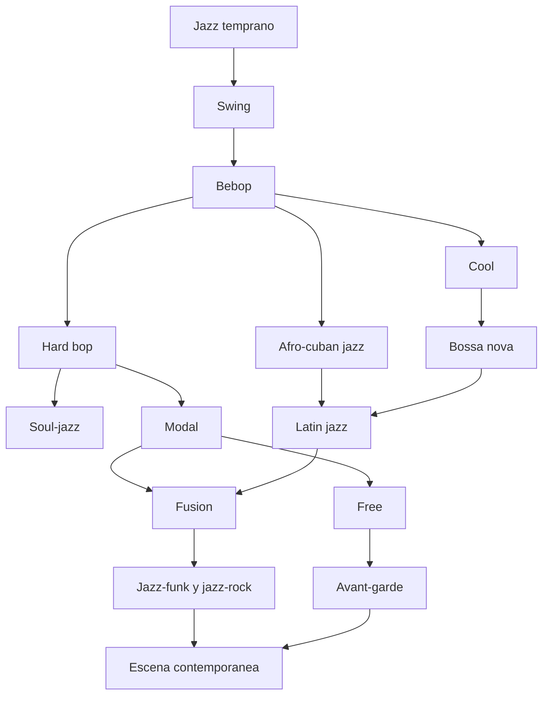

# Estilos de jazz

## Proposito

Esta carpeta organiza el jazz por estilos y familias de lenguaje. Su utilidad principal es auditiva: ayudarte a reconocer por que una musica suena a jazz temprano, a swing, a bebop, a hard bop, a latin jazz o a fusion, y no solo quedarte con nombres sueltos.

## Como estudiar un estilo sin perderte

Conviene usar siempre la misma secuencia:

1. leer un poco de contexto
2. escuchar tres o cuatro piezas representativas
3. comparar dos artistas del mismo estilo
4. notar que cambia respecto al estilo anterior
5. escuchar un album completo

## Orden sugerido

### Si eres principiante

1. [ORIGEN-SWING-Y-BIG-BANDS.md](./ORIGEN-SWING-Y-BIG-BANDS.md)
2. [BEBOP-COOL-Y-HARD-BOP.md](./BEBOP-COOL-Y-HARD-BOP.md)
3. [JAZZ-LATINO-BOSSA-Y-AFROCUBANO.md](./JAZZ-LATINO-BOSSA-Y-AFROCUBANO.md)
4. [MODAL-FREE-FUSION-Y-CONTEMPORANEO.md](./MODAL-FREE-FUSION-Y-CONTEMPORANEO.md)
5. [PRESENTE-DEL-JAZZ-Y-RUTAS-ACTUALES.md](./PRESENTE-DEL-JAZZ-Y-RUTAS-ACTUALES.md)

### Si vienes del rock o del funk

1. empieza por hard bop y modal
2. sigue con fusion
3. vuelve despues al swing y al bebop

### Si vienes de la cancion o de la bossa

1. empieza por [JAZZ-LATINO-BOSSA-Y-AFROCUBANO.md](./JAZZ-LATINO-BOSSA-Y-AFROCUBANO.md)
2. sigue con cool jazz y hard bop
3. vuelve despues al jazz temprano y al swing

## Esquema visual rapido

## Que preguntas conviene hacerse

- la musica esta pensada mas para bailar o para escuchar concentradamente
- manda el arreglo o manda el solista
- el sonido es mas colectivo o mas individual
- el ritmo empuja hacia delante o abre un espacio mas contemplativo
- el grupo suena acustico, electrico, austero o exuberante

## Documentos de esta carpeta

- [ORIGEN-SWING-Y-BIG-BANDS.md](./ORIGEN-SWING-Y-BIG-BANDS.md)
- [BEBOP-COOL-Y-HARD-BOP.md](./BEBOP-COOL-Y-HARD-BOP.md)
- [JAZZ-LATINO-BOSSA-Y-AFROCUBANO.md](./JAZZ-LATINO-BOSSA-Y-AFROCUBANO.md)
- [MODAL-FREE-FUSION-Y-CONTEMPORANEO.md](./MODAL-FREE-FUSION-Y-CONTEMPORANEO.md)
- [PRESENTE-DEL-JAZZ-Y-RUTAS-ACTUALES.md](./PRESENTE-DEL-JAZZ-Y-RUTAS-ACTUALES.md)

## Apoyo visual

- [../RECURSOS-VISUALES/DIAGRAMAS-MERMAID.md](../RECURSOS-VISUALES/DIAGRAMAS-MERMAID.md) incluye un mapa de evolucion de estilos
- [../RECURSOS-VISUALES/ESQUEMAS-EXPLICATIVOS.md](../RECURSOS-VISUALES/ESQUEMAS-EXPLICATIVOS.md) incluye un diagnostico rapido para reconocer estilos al escuchar
- [../RECURSOS-VISUALES/DIAGRAMAS-POR-ESTILO-Y-RUTA.md](../RECURSOS-VISUALES/DIAGRAMAS-POR-ESTILO-Y-RUTA.md) baja la capa visual a estilos y recorridos concretos

## Que deberias aprender aqui

- distinguir estilos por sonido, formacion y funcion cultural
- reconocer artistas que definen o transforman una epoca
- conectar piezas y albumes con familias de lenguaje
- seguir mejor el presente del jazz sin perder la historia
- entender que los estilos no son cajas cerradas, sino zonas de continuidad y friccion
