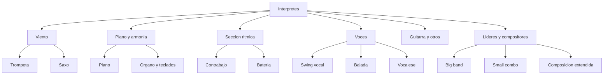

# Interpretes de jazz

## Proposito

Esta carpeta organiza el proyecto alrededor de musicos y musicas esenciales. Es util para quienes aprenden mejor siguiendo voces personales, comparando trayectorias y detectando como un artista cambia el lenguaje desde dentro. El jazz puede estudiarse por estilos o por periodos, pero seguir a los interpretes tiene una ventaja muy concreta: obliga a escuchar decisiones de sonido, de tiempo, de fraseo y de repertorio.

La seccion tiene ahora varias capas. La primera son capitulos por familias instrumentales, pensados para leer con calma. La segunda es un mapa ampliado de consulta con muchos mas nombres, perfiles breves y enlaces directos a Wikipedia para ampliar datos biograficos y discograficos.

Dentro de esa primera capa, [VOCES-ESENCIALES.md](./VOCES-ESENCIALES.md) funciona tambien como puerta al swing vocal, la balada, el vocalese y varias voces contemporaneas.

Ahora se suma tambien una tercera herramienta muy practica: [DISCOGRAFIAS-GUIADAS.md](./DISCOGRAFIAS-GUIADAS.md), pensada para quienes ya reconocen nombres pero no saben por que discos seguir.

Y se anade una cuarta capa de lectura: [RUTAS-POR-FAMILIAS-E-INFLUENCIAS.md](./RUTAS-POR-FAMILIAS-E-INFLUENCIAS.md), util para entender herencias, familias de escucha y genealogias flexibles.

Ahora se suman ademas dos herramientas muy directas: [PERFILES-CORTOS-DE-ARTISTAS-ESENCIALES.md](./PERFILES-CORTOS-DE-ARTISTAS-ESENCIALES.md) para entradas rapidas y [RUTAS-DE-ESCUCHA-POR-FAMILIA.md](./RUTAS-DE-ESCUCHA-POR-FAMILIA.md) para seguir trios, big bands, jazz vocal o presente por familias de escucha.

## Por que conviene estudiar el jazz por interpretes

Un estilo dice mucho, pero una persona concreta dice otra cosa distinta. Dos musicos pueden pertenecer al mismo periodo y sonar como universos opuestos. Por eso esta carpeta busca que el lector no se quede con etiquetas como "bebop" o "cool", sino que aprenda a distinguir personalidades.

### Lo que conviene escuchar en cada artista

- el tipo de sonido
- la relacion con el tiempo
- la manera de frasear
- el peso del silencio o del ataque
- el tipo de repertorio que prefiere
- la manera de liderar o de dialogar con otros

## Como usar esta carpeta

No hace falta estudiar artista por artista como si fueran fichas escolares. Lo mejor es comparar.

## Esquema visual rapido

### Comparaciones utiles

- Louis Armstrong y Miles Davis para pensar dos ideas muy distintas de trompeta
- Charlie Parker y Lester Young para escuchar dos concepciones del fraseo
- Art Tatum y Bill Evans para comparar dos mundos del piano
- Billie Holiday y Ella Fitzgerald para distinguir fraseo dramatico y swing tecnico
- Django Reinhardt y Wes Montgomery para escuchar dos formas radicalmente distintas de guitarra
- Duke Ellington y Charles Mingus para pensar la figura del gran lider-compositor

## Orden sugerido

### Ruta basica

1. [TROMPETA-Y-SAXO.md](./TROMPETA-Y-SAXO.md)
2. [PIANO-Y-SECCION-RITMICA.md](./PIANO-Y-SECCION-RITMICA.md)
3. [VOCES-ESENCIALES.md](./VOCES-ESENCIALES.md)

### Ruta ampliada

4. [GUITARRA-CLARINETE-Y-TROMBON.md](./GUITARRA-CLARINETE-Y-TROMBON.md)
5. [GRANDES-LIDERES-Y-COMPOSITORES.md](./GRANDES-LIDERES-Y-COMPOSITORES.md)
6. [DISCOGRAFIAS-GUIADAS.md](./DISCOGRAFIAS-GUIADAS.md)
7. [RUTAS-POR-FAMILIAS-E-INFLUENCIAS.md](./RUTAS-POR-FAMILIAS-E-INFLUENCIAS.md)
8. [RUTAS-DE-ESCUCHA-POR-FAMILIA.md](./RUTAS-DE-ESCUCHA-POR-FAMILIA.md)
9. [PERFILES-CORTOS-DE-ARTISTAS-ESENCIALES.md](./PERFILES-CORTOS-DE-ARTISTAS-ESENCIALES.md)

### Ruta de consulta amplia

10. [MAPA-AMPLIADO-DE-INTERPRETES.md](./MAPA-AMPLIADO-DE-INTERPRETES.md)

Esta ruta funciona mejor cuando ya reconoces algunos nombres y quieres abrir puertas nuevas. Cada entrada incluye un enlace a Wikipedia, una escucha recomendada, una explicacion de por que importa y conexiones con otros artistas o estilos.

## Documentos de esta carpeta

- [TROMPETA-Y-SAXO.md](./TROMPETA-Y-SAXO.md)
- [PIANO-Y-SECCION-RITMICA.md](./PIANO-Y-SECCION-RITMICA.md)
- [VOCES-ESENCIALES.md](./VOCES-ESENCIALES.md)
- [GUITARRA-CLARINETE-Y-TROMBON.md](./GUITARRA-CLARINETE-Y-TROMBON.md)
- [GRANDES-LIDERES-Y-COMPOSITORES.md](./GRANDES-LIDERES-Y-COMPOSITORES.md)
- [DISCOGRAFIAS-GUIADAS.md](./DISCOGRAFIAS-GUIADAS.md)
- [RUTAS-POR-FAMILIAS-E-INFLUENCIAS.md](./RUTAS-POR-FAMILIAS-E-INFLUENCIAS.md)
- [RUTAS-DE-ESCUCHA-POR-FAMILIA.md](./RUTAS-DE-ESCUCHA-POR-FAMILIA.md)
- [PERFILES-CORTOS-DE-ARTISTAS-ESENCIALES.md](./PERFILES-CORTOS-DE-ARTISTAS-ESENCIALES.md)
- [MAPA-AMPLIADO-DE-INTERPRETES.md](./MAPA-AMPLIADO-DE-INTERPRETES.md)

## Criterios del mapa ampliado

El mapa ampliado mezcla varios tipos de importancia:

- figuras fundacionales que cambian el lenguaje de un instrumento
- musicos puente que explican transiciones historicas
- solistas con una voz inconfundible
- lideres capaces de formar generaciones o imaginar nuevos formatos
- compositoras, compositores y arreglistas que amplian la idea de jazz
- voces contemporaneas que mantienen vivo el genero sin copiar el pasado

Los enlaces a Wikipedia no sustituyen la escucha. Sirven como punto de partida para fechas, contexto biografico, discografias y conexiones entre musicos. La regla editorial sigue siendo la misma: primero escuchar, despues leer, y luego volver a escuchar con mas oido.

## Apoyo visual

- [../RECURSOS-VISUALES/DIAGRAMAS-MERMAID.md](../RECURSOS-VISUALES/DIAGRAMAS-MERMAID.md) incluye un mapa rapido de familias de interpretes
- [../RECURSOS-VISUALES/IMAGENES-DOMINIO-PUBLICO.md](../RECURSOS-VISUALES/IMAGENES-DOMINIO-PUBLICO.md) incluye imagenes libres de figuras como Louis Armstrong, Art Tatum, Billie Holiday, Charlie Parker, Dizzy Gillespie, Miles Davis y Thelonious Monk

## Rutas de entrada segun tu oido

### Si buscas melodias muy claras

- Miles Davis
- Chet Baker
- Ella Fitzgerald
- Stan Getz a traves de otras secciones del proyecto

### Si buscas intensidad y riesgo

- Charlie Parker
- John Coltrane
- Thelonious Monk
- Charles Mingus

### Si vienes del rock o del groove

- Herbie Hancock
- Weather Report desde la carpeta de estilos
- Pat Metheny
- Robert Glasper desde la parte contemporanea del proyecto

### Si vienes de la cancion

- Billie Holiday
- Sarah Vaughan
- Nina Simone
- Carmen McRae

### Si quieres explorar mas alla del canon basico

- Mary Lou Williams
- Don Cherry
- Geri Allen
- Henry Threadgill
- Maria Schneider
- Cecile McLorin Salvant

### Si quieres conectar jazz clasico y jazz actual

- Herbie Hancock
- Wayne Shorter
- Dave Holland
- Jack DeJohnette
- Esperanza Spalding
- Ambrose Akinmusire
- Kamasi Washington

## Preguntas utiles al comparar interpretes

- quien se apoya mas en la melodia y quien la disloca
- quien parece hablar con frases largas y quien trabaja por motivos pequenos
- quien ocupa el espacio y quien deja aire
- quien convierte el tiempo en tension y quien lo convierte en suspension
- quien suena mas cercano al blues, al gospel, al lirismo o a la abstraccion

## Lo que deberias aprender aqui

- reconocer personalidades musicales distintas
- comparar interpretes del mismo instrumento sin reducirlos a jerarquias vacias
- construir rutas de escucha centradas en artistas
- pasar de un nombre admirado a una pequena discografia razonable y progresiva
- seguir una linea de influencia sin confundir genealogia con copia
- elegir mejor una puerta de entrada segun familia de escucha o nivel previo
- relacionar biografia, sonido y contexto historico
- entender que el jazz es historia colectiva, pero siempre atravesada por voces individuales
