# Diagramas Mermaid

## Como leer estos diagramas

Los diagramas Mermaid sirven para ver relaciones de un vistazo. No sustituyen los capitulos largos: ayudan a decidir por donde entrar, que comparar y que escuchar despues.

## Mapa general del repositorio

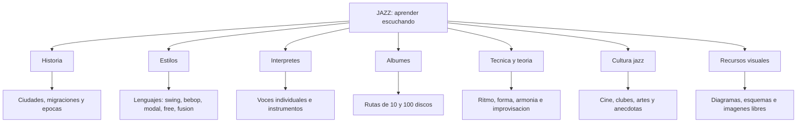

## Linea historica simplificada

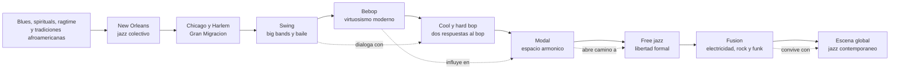

## Evolucion de estilos

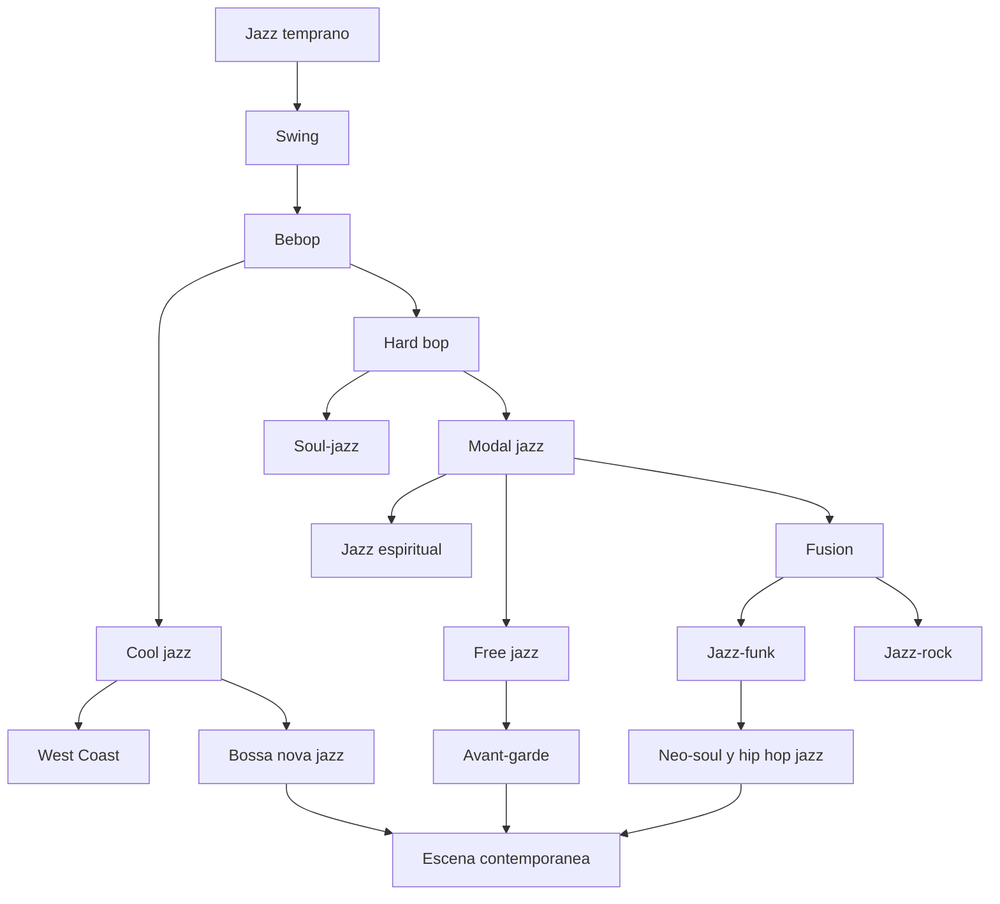

## Como se transforma una pieza en directo

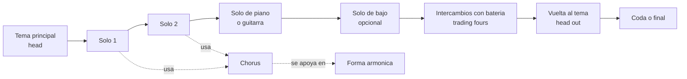

## Anatomia de un small combo

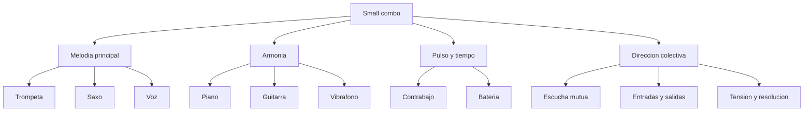

## Improvisacion como ciclo de decisiones

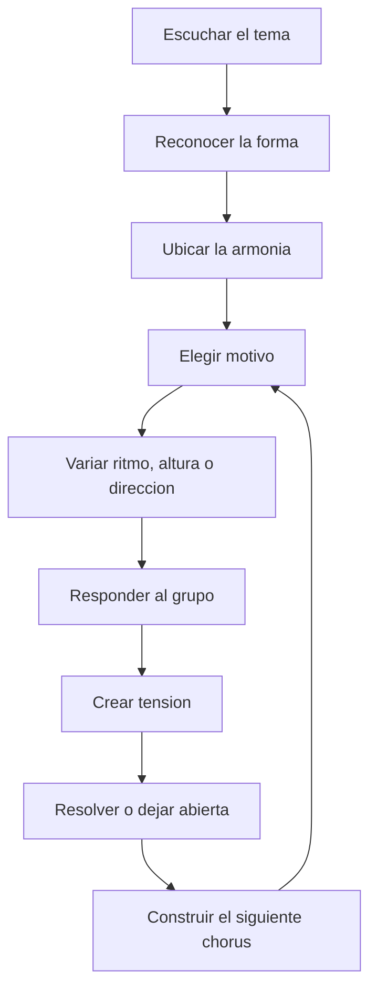

## Formas basicas: blues y AABA

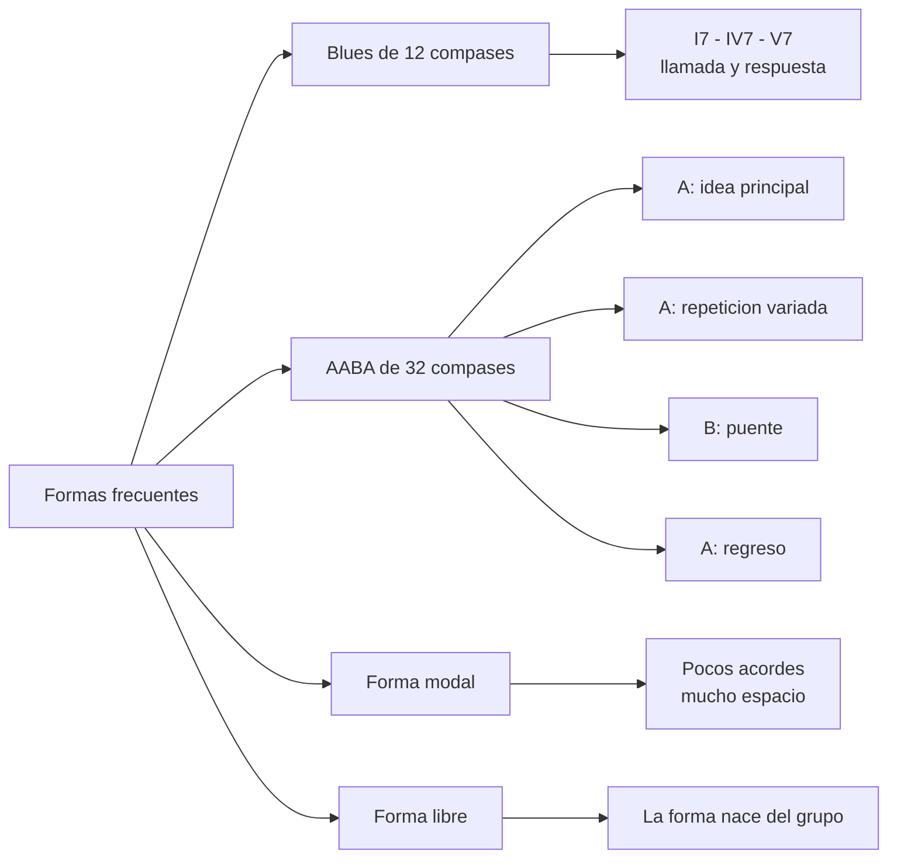

## De la escucha superficial a la escucha profunda

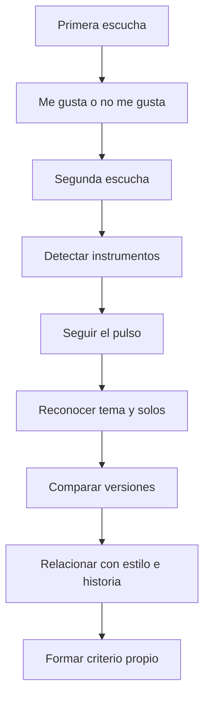

## Mapa rapido de interpretes

```mermaid
flowchart TD
    A["Interpretes"] --> B["Trompeta"]
    A --> C["Saxo"]
    A --> D["Piano"]
    A --> E["Seccion ritmica"]
    A --> F["Voces"]
    A --> G["Guitarra y otros instrumentos"]
    A --> H["Lideres y compositores"]

    B --> B1["Armstrong"]
    B --> B2["Dizzy"]
    B --> B3["Miles"]
    B --> B4["Hubbard"]

    C --> C1["Hawkins"]
    C --> C2["Parker"]
    C --> C3["Coltrane"]
    C --> C4["Shorter"]

    D --> D1["Art Tatum"]
    D --> D2["Monk"]
    D --> D3["Bill Evans"]
    D --> D4["Herbie Hancock"]

    E --> E1["Mingus"]
    E --> E2["Ron Carter"]
    E --> E3["Max Roach"]
    E --> E4["Elvin Jones"]

    F --> F1["Billie Holiday"]
    F --> F2["Ella Fitzgerald"]
    F --> F3["Sarah Vaughan"]
    F --> F4["Nina Simone"]

    H --> H1["Ellington"]
    H --> H2["Basie"]
    H --> H3["Mingus"]
    H --> H4["Maria Schneider"]
```

## Ruta de 100 albumes como aprendizaje por bloques

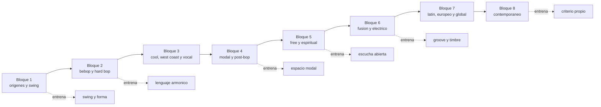

## Relacion entre historia, tecnica y cultura

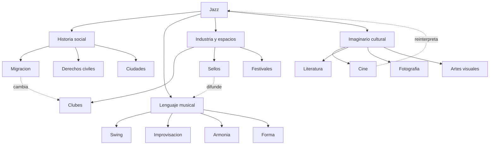
