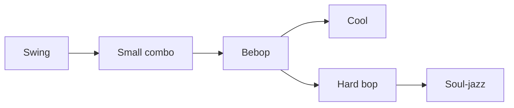
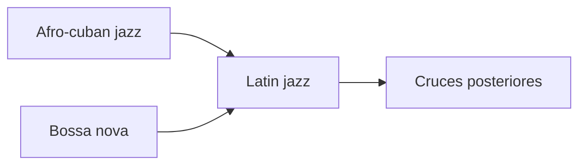
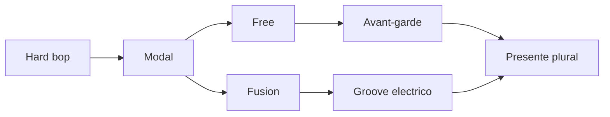
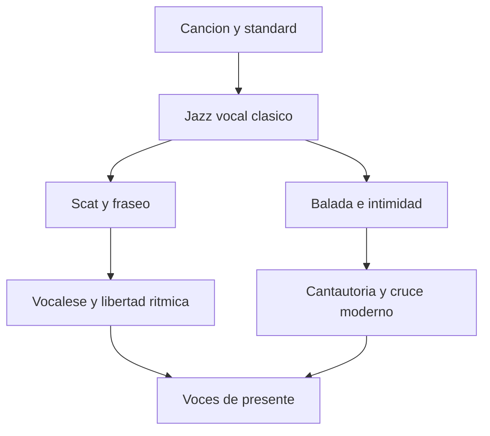
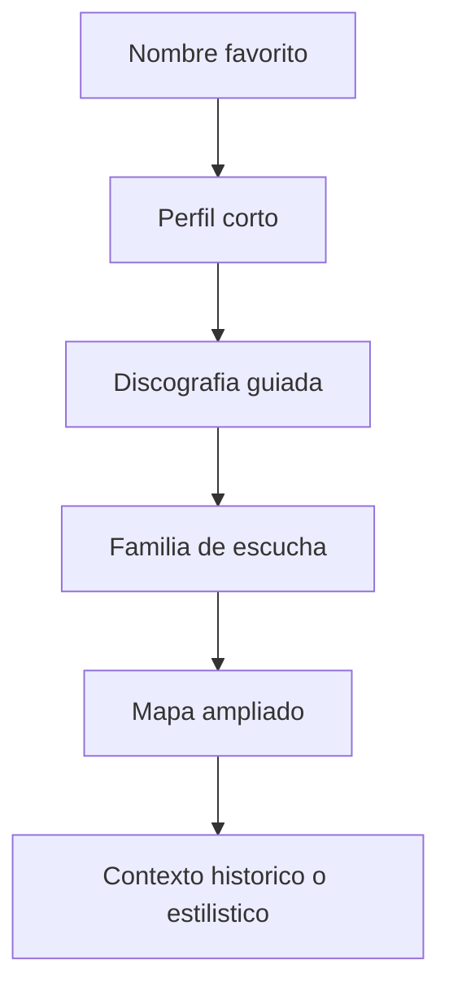
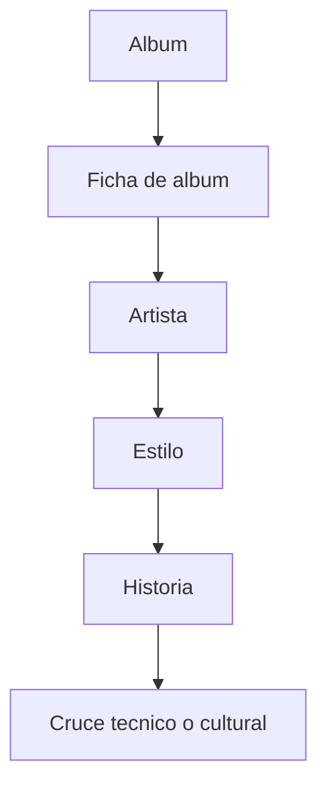
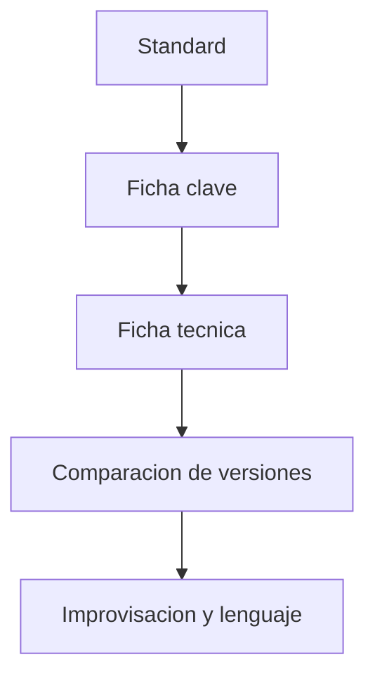
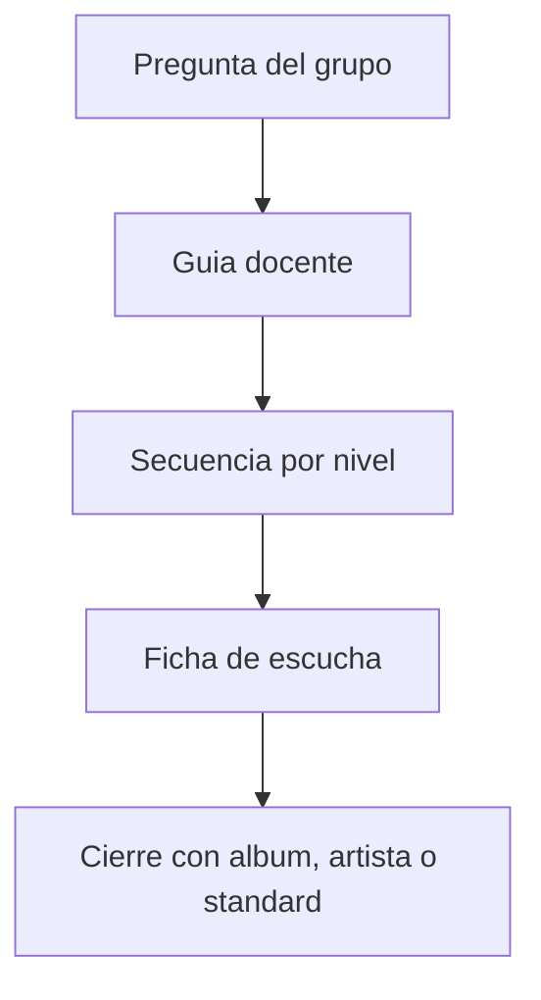
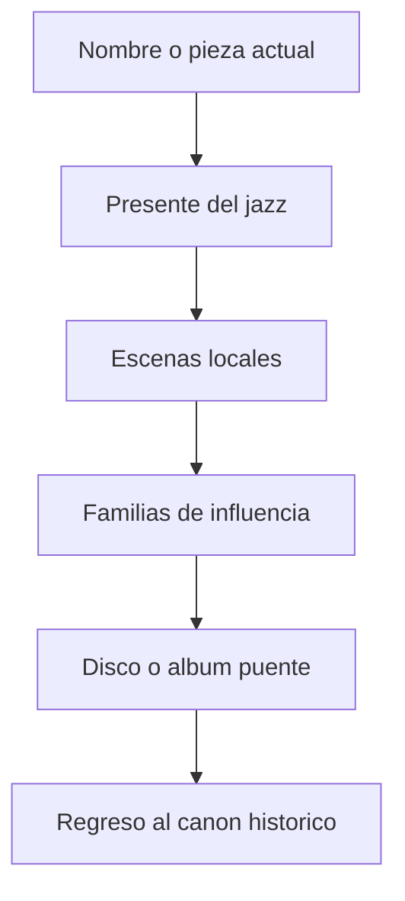

# Diagramas por estilo y ruta

Este documento reune diagramas mas especificos que los del mapa general. Sirve para visualizar rutas concretas del proyecto y para preparar clases, talleres o autoestudio.

No sustituye a los capitulos largos. Su funcion es otra: condensar relaciones, ayudar a comparar etapas y ofrecer puertas de entrada rapidas cuando alguien todavia no sabe por donde seguir.

## Como usar bien estos diagramas

- leelos primero de izquierda a derecha o de arriba abajo
- identifica que relacion muestran: historia, estilo, repertorio, artista o metodo
- no los tomes como lineas rectas inevitables
- vuelve siempre al documento largo correspondiente despues de mirar el esquema

## 1. Del jazz temprano al swing

### Que ayuda a ver

- paso de raices multiples a una escena urbana mas organizada
- importancia de las migraciones y de los centros de trabajo musical
- transicion desde practicas comunitarias hacia formatos mas profesionalizados

## 2. Del swing al bebop y al hard bop

### Que ayuda a ver

- el bebop como nucleo de modernizacion fuerte
- bifurcacion entre depuracion cool y energia hard bop
- continuidad entre small combo, improvisacion compleja y groove posterior

## 3. Ruta latin jazz y bossa

### Que ayuda a ver

- convergencia de dos tradiciones distintas en una zona de intercambio
- peso del ritmo y del pulso como motor de transformacion
- apertura del jazz a una escucha menos centrada solo en Estados Unidos

## 4. Modal, free, fusion y presente

### Que ayuda a ver

- como una misma base moderna genera respuestas muy distintas
- diferencia entre expansion de la forma, ruptura y electrificacion
- pluralidad del presente, que no se deja reducir a una sola genealogia

## 5. Ruta vocal

### Que ayuda a ver

- que la voz en jazz no es solo "cantar bonito"
- relacion entre letra, fraseo, repertorio y personalidad
- continuidad entre canon clasico y voces contemporaneas

## 6. Ruta por artistas

### Que ayuda a ver

- como pasar de una afinidad inicial a un recorrido mas serio
- importancia de no quedarse solo en un nombre aislado
- necesidad de devolver siempre el artista a su familia y a su epoca

## 7. Ruta por albumes

### Que ayuda a ver

- el album como puerta de entrada integral
- relacion entre escucha concreta y contexto mas amplio
- paso natural de la curiosidad inicial a una escucha comparada

## 8. Ruta por standards

### Que ayuda a ver

- paso de repertorio a tecnica aplicada
- utilidad del standard como eje de memoria y comparacion
- valor de escuchar varias versiones antes de teorizar en exceso

## 9. Ruta docente

### Que ayuda a ver

- como convertir una pregunta amplia en secuencia practicable
- relacion entre mediacion, escucha y cierre concreto
- flexibilidad de uso del proyecto en aula, taller o club

## 10. Ruta de entrada al presente

### Que ayuda a ver

- que el presente no se estudia aislado del pasado
- como una escena actual puede llevarte hacia genealogias mas largas
- utilidad de volver del presente al canon y no solo del canon al presente

## 11. Cautelas utiles

Un diagrama siempre recorta. Eso es util, pero tambien peligroso si olvidamos lo que deja fuera. Conviene recordar:

- varias escenas conviven en paralelo
- un mismo artista puede cruzar varios caminos
- las etiquetas estilisticas son aproximaciones, no cajones cerrados
- algunas rutas son historicas y otras son solo pedagogicas

## Cruces utiles

- [DIAGRAMAS-MERMAID.md](./DIAGRAMAS-MERMAID.md)
- [../RUTAS-CRUZADAS-PARA-ESTUDIAR-JAZZ.md](../RUTAS-CRUZADAS-PARA-ESTUDIAR-JAZZ.md)
- [../ESTILOS/README.md](../ESTILOS/README.md)
- [../INTERPRETES/README.md](../INTERPRETES/README.md)
- [../APRENDER-JAZZ-OYENDO-ALBUMES/README.md](../APRENDER-JAZZ-OYENDO-ALBUMES/README.md)

## Idea final

Un buen diagrama no simplifica el jazz hasta vaciarlo. Lo hace mas legible sin quitarle espesor.
