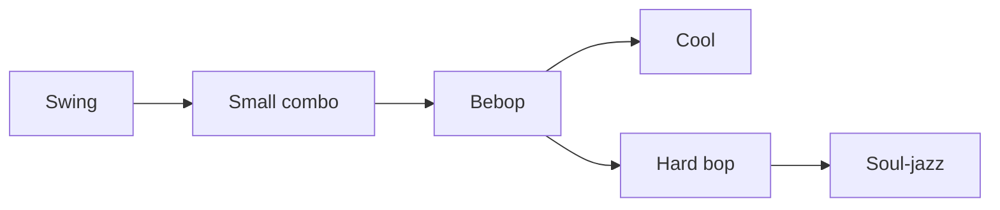
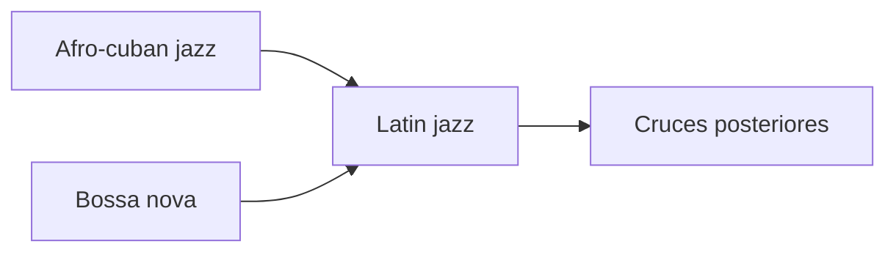
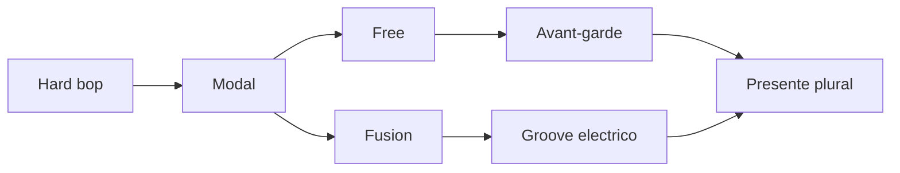
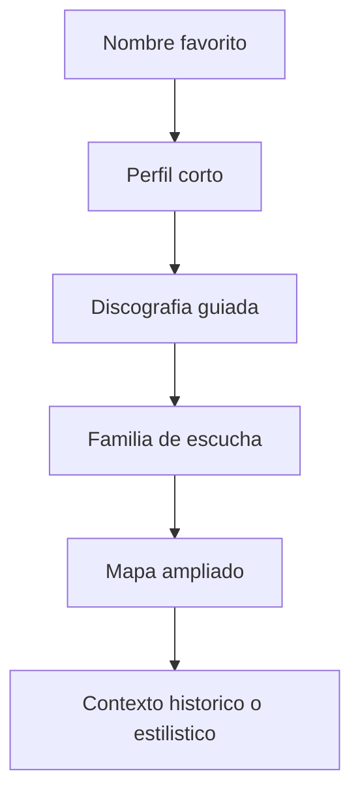
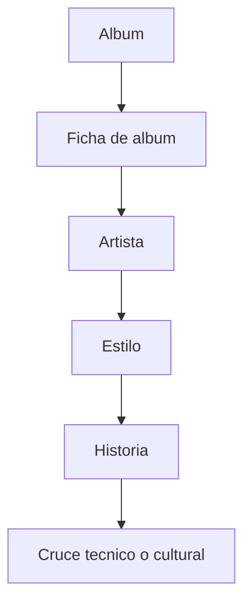
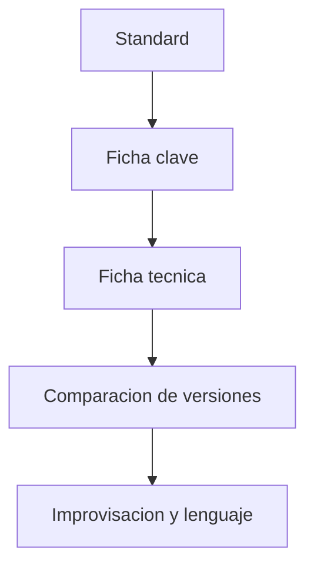
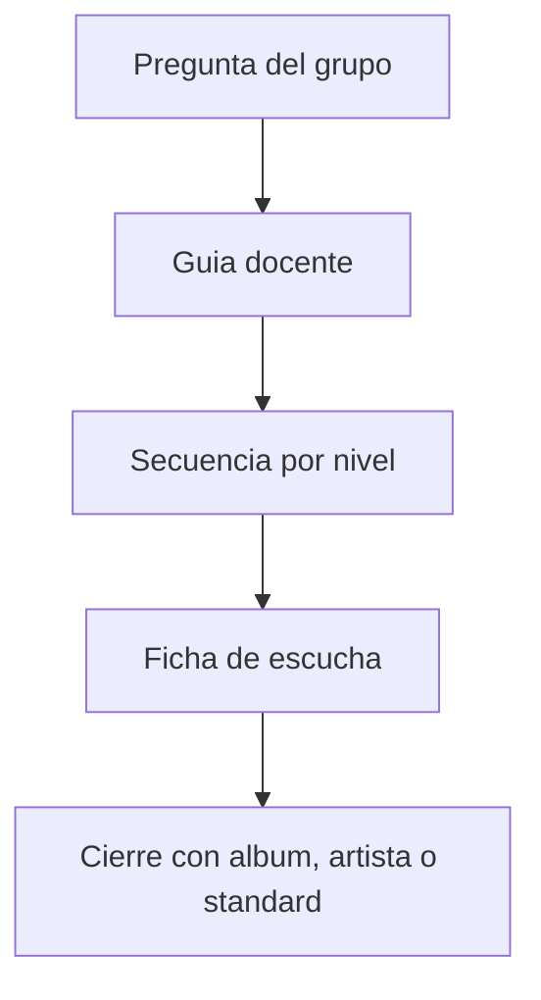

# Diagramas por estilo y ruta

Este documento reune diagramas mas especificos que los del mapa general. Sirve para visualizar rutas concretas del proyecto y para preparar clases, talleres o autoestudio.

## 1. Del jazz temprano al swing

## 2. Del swing al bebop y al hard bop

## 3. Ruta latin jazz y bossa

## 4. Modal, free, fusion y presente

## 5. Ruta por artistas

## 6. Ruta por albumes

## 7. Ruta por standards

## 8. Ruta docente

## Cruces utiles

- [DIAGRAMAS-MERMAID.md](./DIAGRAMAS-MERMAID.md)
- [../RUTAS-CRUZADAS-PARA-ESTUDIAR-JAZZ.md](../RUTAS-CRUZADAS-PARA-ESTUDIAR-JAZZ.md)
- [../ESTILOS/README.md](../ESTILOS/README.md)

## Idea final

Un buen diagrama no simplifica el jazz hasta vaciarlo. Lo hace mas legible sin quitarle espesor.
