# Formas, standards y progresiones en diagramas

## Proposito

Este documento traduce algunas estructuras tecnicas del jazz a diagramas Mermaid. Su objetivo no es sustituir una partitura, sino ofrecer mapas para escuchar: donde vuelve el tema, cuando cambia la armonia, por que un solo tiene direccion y como se organiza una improvisacion.

## Blues de 12 compases

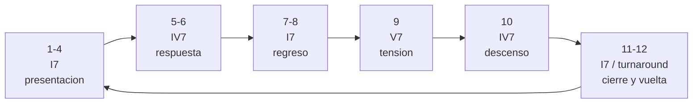

### Como escucharlo

- Los cuatro primeros compases establecen casa.
- El paso al IV7 abre una respuesta.
- El V7 crea empuje hacia el final.
- El turnaround prepara el siguiente chorus.

## Blues menor

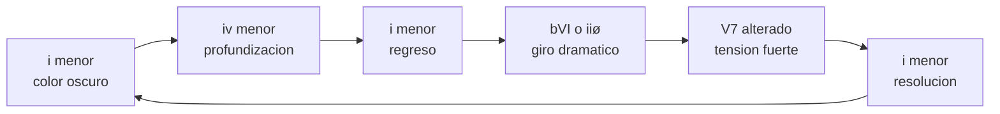

### Como escucharlo

El blues menor conserva la respiracion del blues, pero cambia el color emocional. Suele sonar mas nocturno, mas denso o mas dramatico.

## Rhythm changes

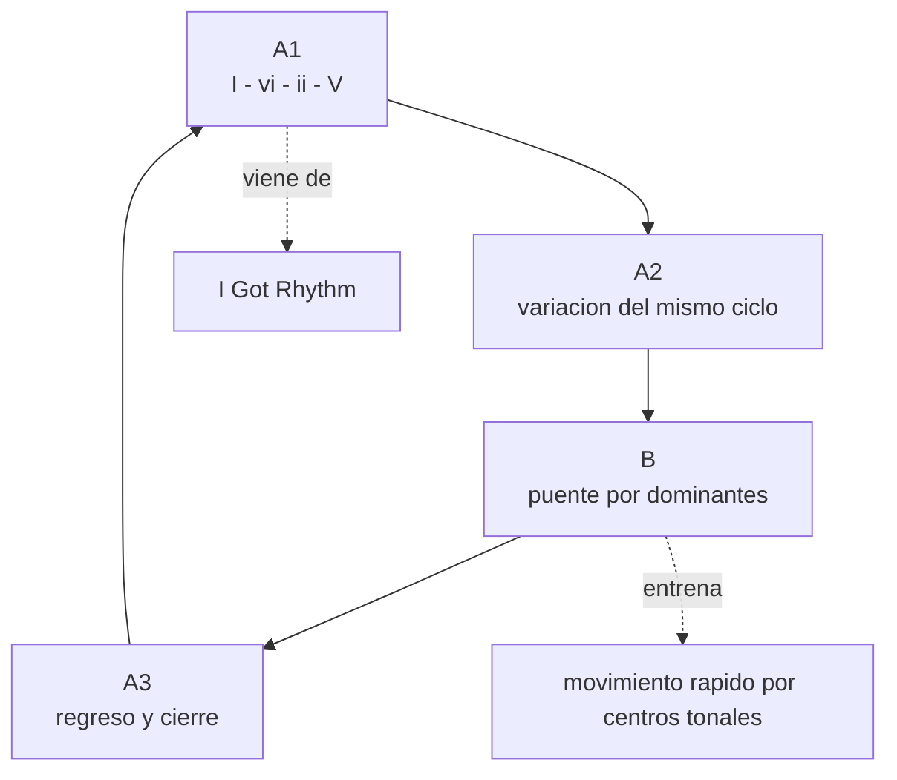

### Como escucharlo

Rhythm changes suele sentirse como una pista de carreras armonica. Si pierdes los acordes, sigue la forma: A, A, puente, A.

## Forma AABA

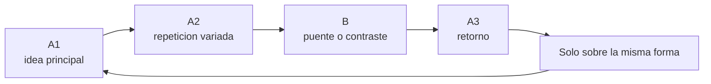

### Como escucharlo

Muchos standards funcionan como una pequena narracion: presentacion, confirmacion, viaje y regreso.

## Forma ABAC

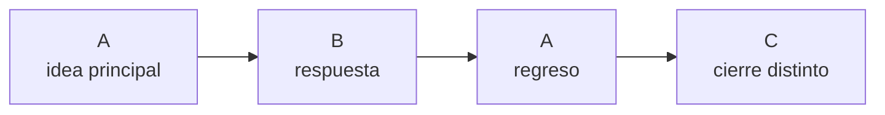

### Como escucharlo

ABAC se parece a AABA, pero el final no vuelve exactamente al punto de partida. Puede sonar mas conclusivo o mas cantable.

## Vamp modal

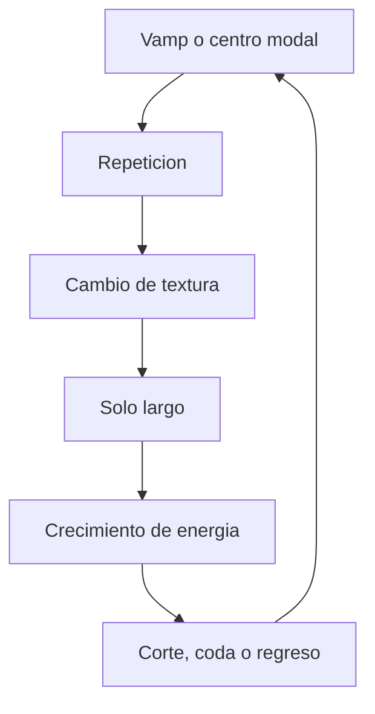

### Como escucharlo

En el jazz modal, la pregunta no es siempre "que acorde viene ahora". Muchas veces es "que cambia dentro de un espacio aparentemente estable".

## ii-V-I

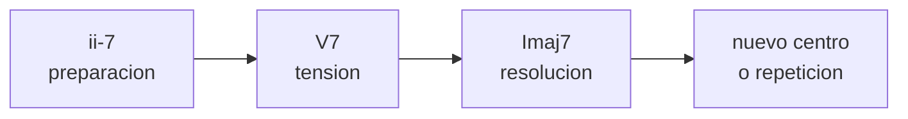

### Como escucharlo

El ii-V-I es una de las frases gramaticales del jazz. No es una cancion, sino una manera de moverse hacia casa.

## Dominante secundaria

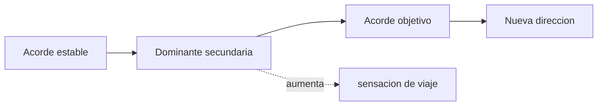

### Como escucharlo

Una dominante secundaria hace que un acorde momentaneo parezca centro de gravedad. Es como encender una luz sobre un lugar al que la musica quiere ir.

## Sustitucion de tritono

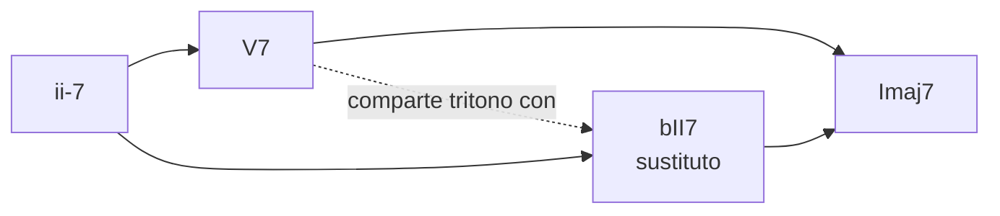

### Como escucharlo

La sustitucion de tritono suele sonar mas cromatica y sofisticada. En vez de caer de V a I, la armonia puede deslizarse por semitono.

## Coltrane changes

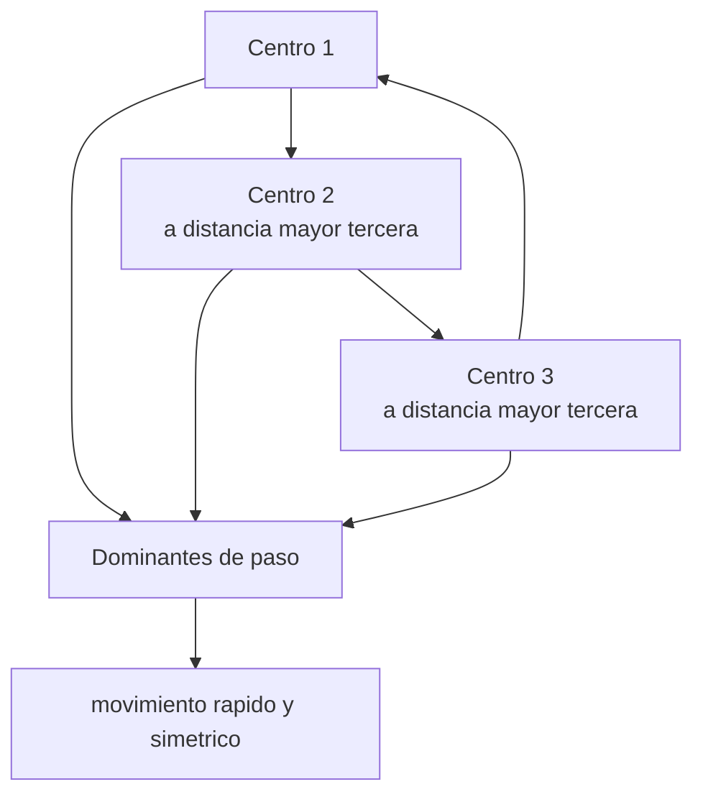

### Como escucharlo

En piezas como "Giant Steps", la dificultad no es solo la velocidad. Es que los centros tonales cambian con una logica simetrica que obliga al solista a pensar en grandes saltos.

## Construccion de un solo

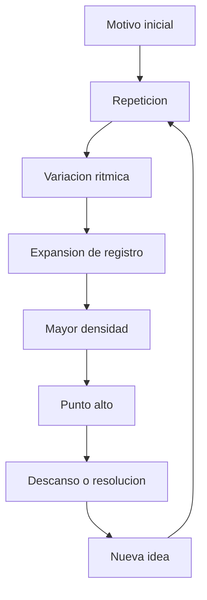

### Como escucharlo

Un buen solo no es una lista de frases. Tiene memoria. Repite, transforma, sube, descansa y vuelve a empezar con algo aprendido.

## Dialogo entre solista y seccion ritmica

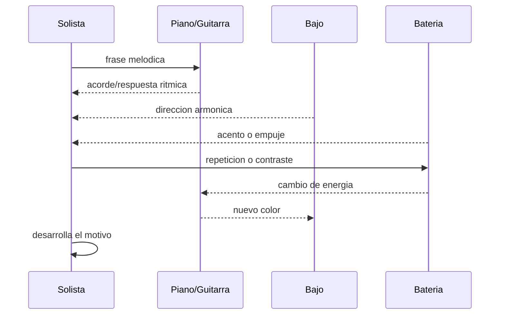

### Como escucharlo

El solista no improvisa en el vacio. La seccion ritmica propone, contradice, empuja, frena y cambia el clima.

## Mapa de escucha de un standard

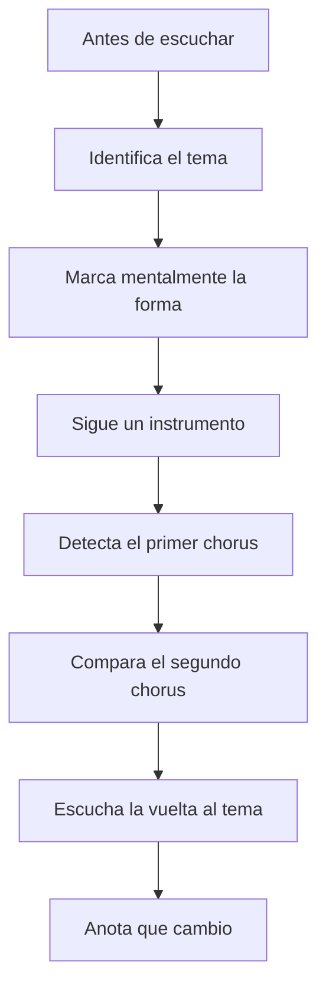

### Pregunta final

Si al final el tema vuelve y suena distinto, el grupo ha contado una historia. Esa es una de las claves del jazz.
