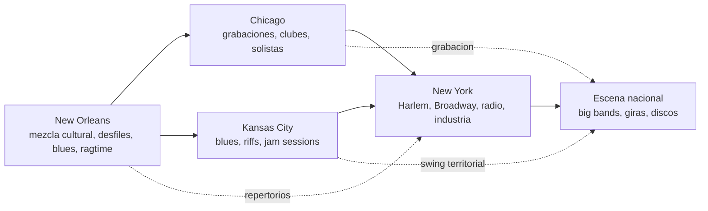
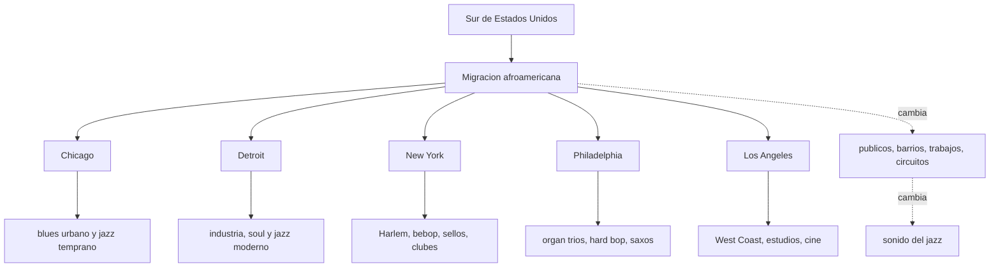
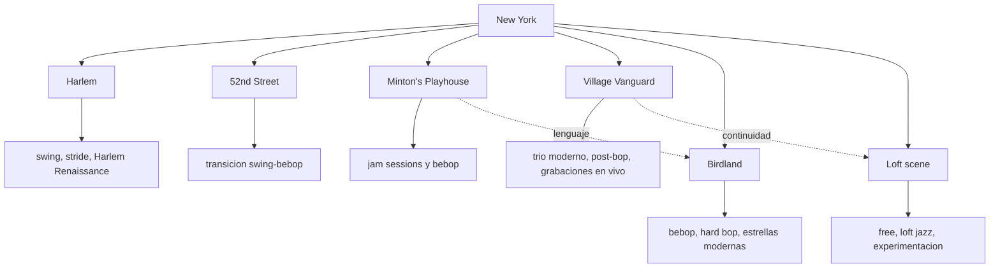
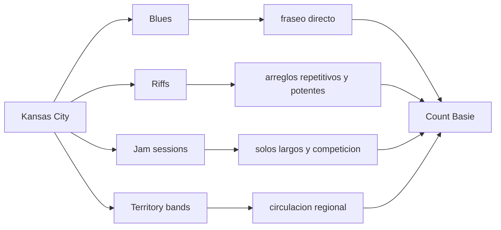
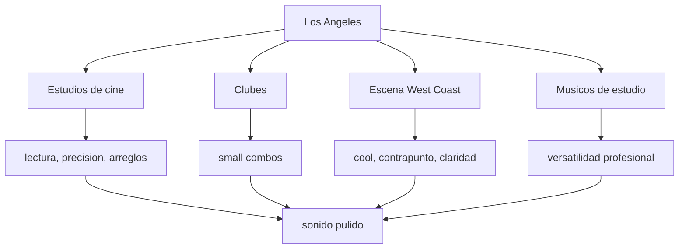
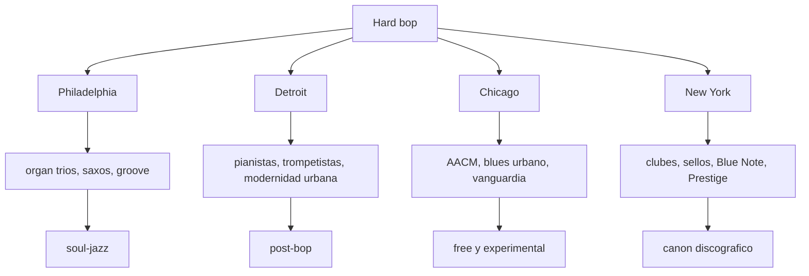
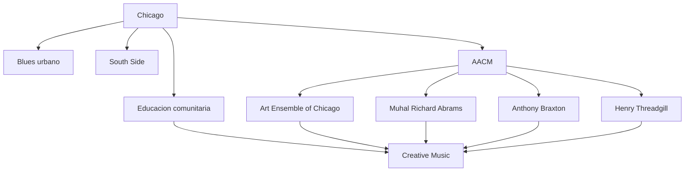
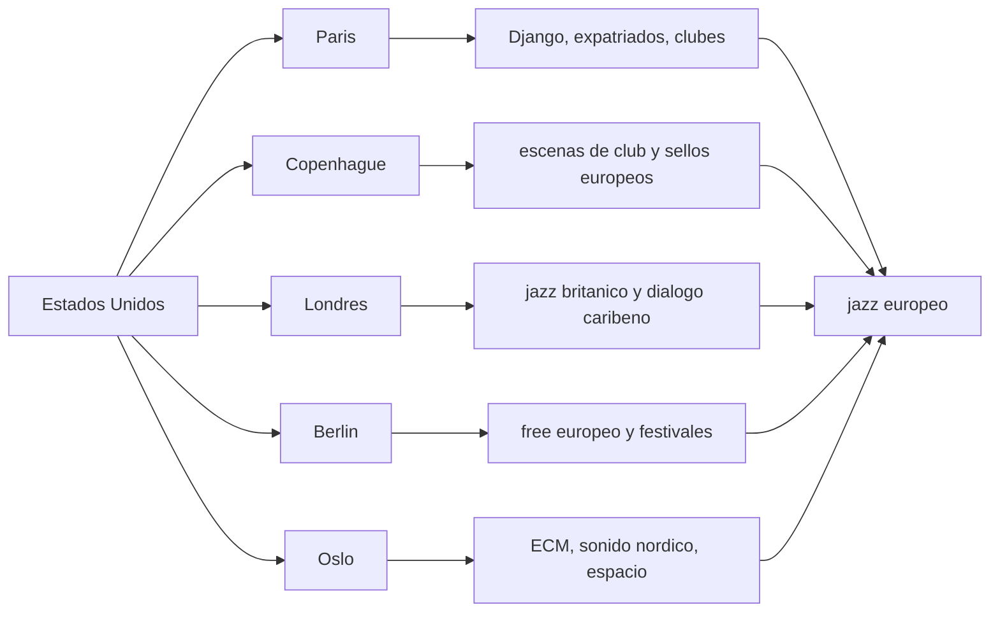
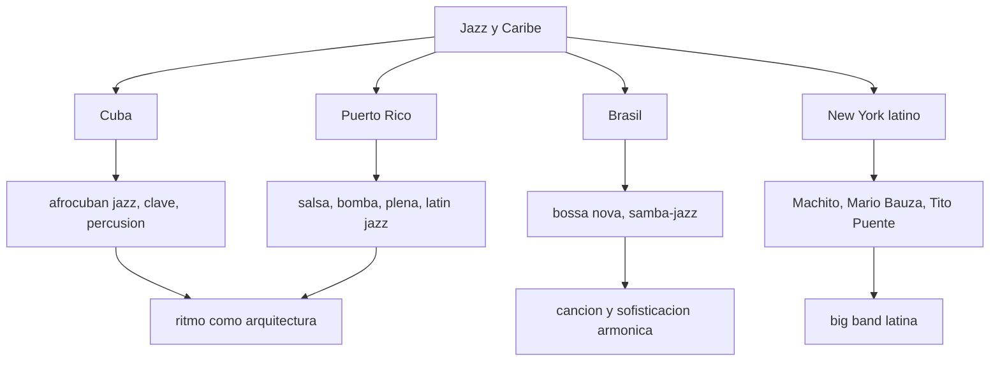
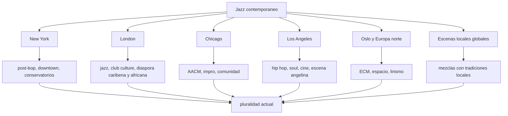

# Mapas de ciudades y escenas

## Proposito

El jazz no nace ni evoluciona en abstracto. Cambia porque las personas migran, los clubes se abren o cierran, los sellos graban ciertas escenas, las radios difunden nuevos sonidos y las ciudades producen comunidades concretas. Estos mapas ayudan a ver la dimension geografica del jazz.

No son mapas cartograficos exactos. Son mapas culturales: muestran circulacion, influencia, tension y transformacion.

## Mapa 1: de New Orleans a la escena nacional

### Como leerlo

- New Orleans aporta una cultura musical colectiva.
- Chicago ayuda a fijar el jazz en disco y a hacer mas visible al solista.
- Kansas City refuerza el blues, el riff y la jam session.
- New York concentra industria, teatros, clubes, prensa y experimentacion.

## Mapa 2: la Gran Migracion como motor musical

### Idea clave

La Gran Migracion no solo mueve poblacion. Mueve repertorios, iglesias, modos de bailar, formas de hablar, redes familiares, economias de club y aspiraciones politicas. Por eso modifica tambien el sonido.

## Mapa 3: New York como laboratorio

### Pregunta de escucha

Cuando escuches un disco grabado en New York, pregunta si suena a club, a teatro, a estudio, a jam session o a comunidad experimental. La ciudad no es solo escenario: tambien organiza el tipo de escucha.

## Mapa 4: Kansas City y el swing territorial

### Que escuchar

- Secciones ritmicas que empujan sin rigidez.
- Riffs que parecen sencillos pero construyen energia colectiva.
- Solistas que desarrollan ideas largas sobre estructuras claras.

## Mapa 5: Los Angeles, estudios y West Coast

### Cuidado editorial

West Coast no significa simplemente jazz frio o sin emocion. Muchas veces significa otro equilibrio entre arreglo, timbre, control formal y espacio.

## Mapa 6: Philadelphia, Detroit y Chicago en el hard bop

### Idea clave

El hard bop no es solo un estilo neoyorquino. Es una red urbana: iglesias, barrios, escuelas, clubes, sellos y musicos que viajan.

## Mapa 7: Chicago y la AACM

### Que aporta

Chicago ayuda a entender una idea de jazz donde la experimentacion no se separa de la comunidad. La vanguardia no aparece como capricho individual, sino como organizacion, pedagogia y autonomia cultural.

## Mapa 8: rutas transatlanticas

### Pregunta de escucha

Cuando escuches jazz europeo, no preguntes solo si se parece al jazz estadounidense. Pregunta que cambia: el espacio, el timbre, la relacion con la musica clasica, la improvisacion libre, el folk local o la produccion sonora.

## Mapa 9: jazz latino y Caribe

### Que escuchar

- La clave como organizadora, no como adorno.
- La percusion como estructura, no como color exotico.
- El dialogo entre cancion, baile e improvisacion.

## Mapa 10: escena contemporanea global

### Cierre

La historia del jazz se entiende mejor si se escucha como una red de ciudades. Cada escena combina condiciones sociales, circuitos economicos, tecnologias, publicos y deseos esteticos. El sonido viaja, pero nunca llega intacto: siempre se transforma.
