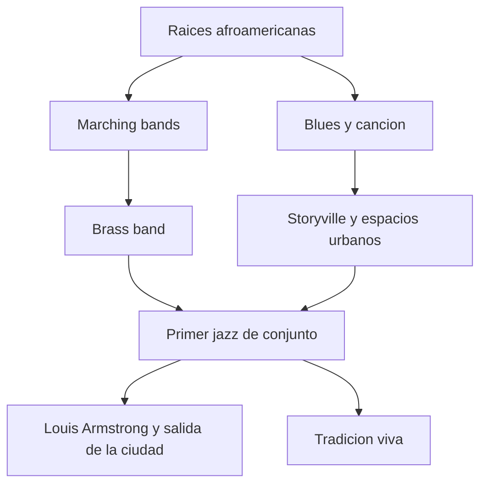
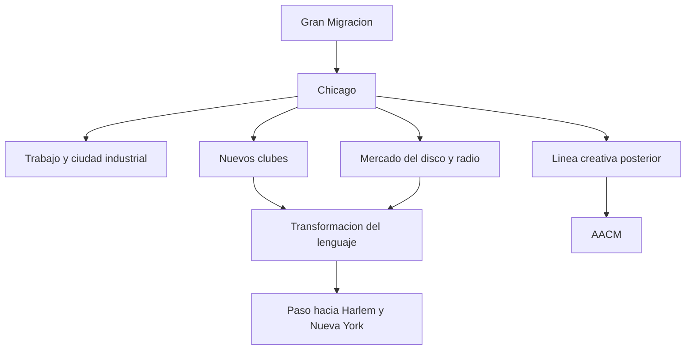
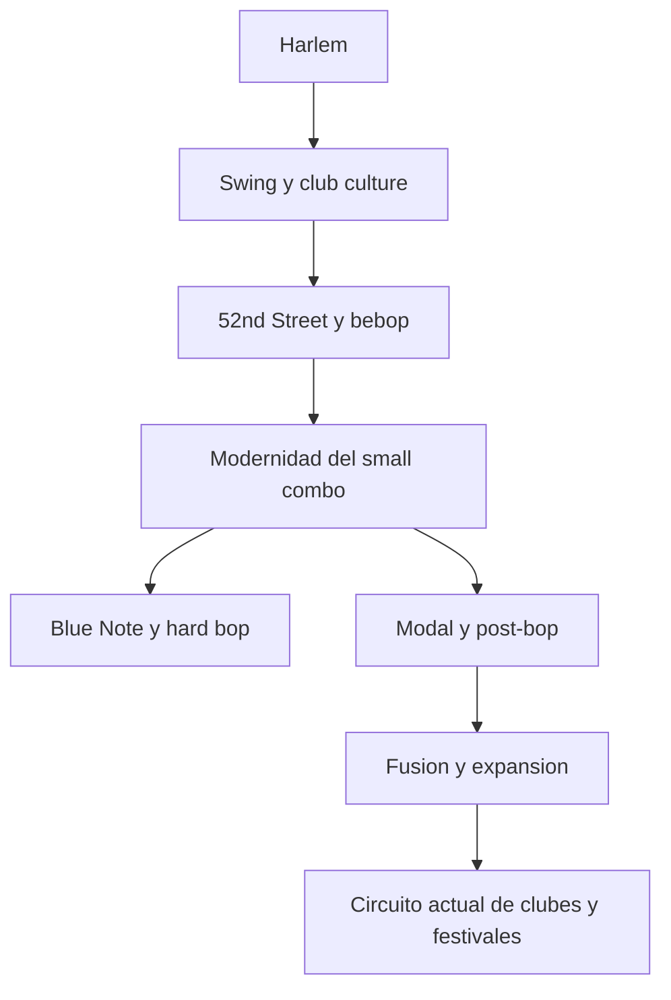
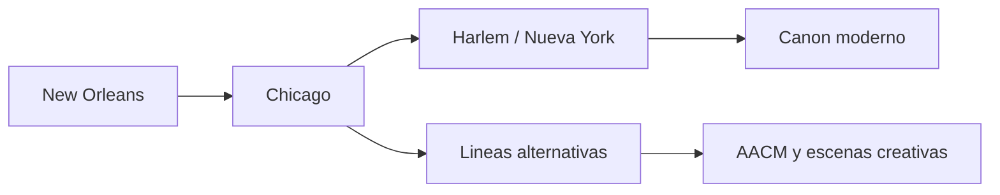

# Mapas de New Orleans, Chicago y Nueva York

Este documento amplifica la capa geografica del proyecto con tres mapas muy concretos. No intenta dibujar calles exactas. Intenta aclarar funciones culturales y transiciones historicas.

Conviene leerlos como mapas conceptuales. No muestran coordenadas, sino relaciones: migracion, trabajo musical, tipos de espacio, cambios de lenguaje y continuidad entre escenas.

## Como usar estos mapas

- miralos primero como relato de desplazamientos
- identifica despues que espacios pesan mas: calle, club, estudio, festival o barrio
- cruza cada ciudad con un artista, un estilo y una practica social
- vuelve despues al capitulo historico correspondiente

## 1. New Orleans

### Que ayuda a ver

- mezcla de tradiciones
- centralidad del conjunto
- continuidad entre origen y presente

### Lo que conviene anadir mentalmente

- peso de ceremonias, desfiles y usos comunitarios
- relacion entre musica, barrio y circulacion social
- diferencia entre origen historico y posterior mitificacion turistica

## 2. Chicago

### Que ayuda a ver

- migracion
- profesionalizacion
- continuidad entre historia temprana y creatividad posterior

### Lo que conviene anadir mentalmente

- paso de escena local a ciudad industrial moderna
- impacto de radio, disco y trabajo urbano
- posibilidad de continuidad creativa hasta la AACM y mas alla

## 3. Nueva York

### Que ayuda a ver

- paso de la capital simbolica del swing a la modernidad bop
- consolidacion del small combo
- peso del presente institucional y de circuito

### Lo que conviene anadir mentalmente

- concentracion de critica, mercado y prestigio
- convivencia entre club, conservatorio, sello y festival
- facilidad con la que una escena central corre el riesgo de ocultar otras periferias

## 4. Comparacion rapida entre las tres ciudades

### New Orleans

- origen social y comunitario
- calle, desfile y mezcla cultural
- sentido fuerte de continuidad tradicional

### Chicago

- ciudad de migracion y transformacion
- profesionalizacion y lenguaje urbano
- puente entre pasado temprano y vanguardias posteriores

### Nueva York

- capital simbolica y economica
- concentracion de estilos, mercado y medios
- gran laboratorio de modernidad jazzistica

## 5. Un mapa de paso entre ciudades

### Que ayuda a ver

- que la historia del jazz no es inmovil
- que cada traslado cambia el sonido y tambien la funcion social de la musica
- que no todo desemboca en una sola linea central

## 6. Preguntas utiles para clase o autoestudio

- que tipo de espacio domina en cada ciudad
- que cambia cuando la musica pasa de calle a club o de club a estudio
- que papel juega la migracion en el cambio de lenguaje
- por que algunas ciudades se vuelven simbolicas y otras quedan menos visibles

## 7. Cruces utiles

- [MAPAS-DE-CIUDADES-Y-ESCENAS.md](./MAPAS-DE-CIUDADES-Y-ESCENAS.md)
- [../HISTORIA-DEL-JAZZ/CRONOLOGIAS-POR-INSTRUMENTO-Y-ESCENA.md](../HISTORIA-DEL-JAZZ/CRONOLOGIAS-POR-INSTRUMENTO-Y-ESCENA.md)
- [../HISTORIA-DEL-JAZZ/CIUDADES-Y-ESCENAS-CLAVE.md](../HISTORIA-DEL-JAZZ/CIUDADES-Y-ESCENAS-CLAVE.md)
- [../CULTURA-JAZZ/LUGARES-CLUBES-Y-CIUDADES.md](../CULTURA-JAZZ/LUGARES-CLUBES-Y-CIUDADES.md)

## 8. Idea final

Pensar el jazz por ciudades no es decorar la historia con nombres de mapa. Es entender que el sonido necesita lugares, circuitos y desplazamientos.
