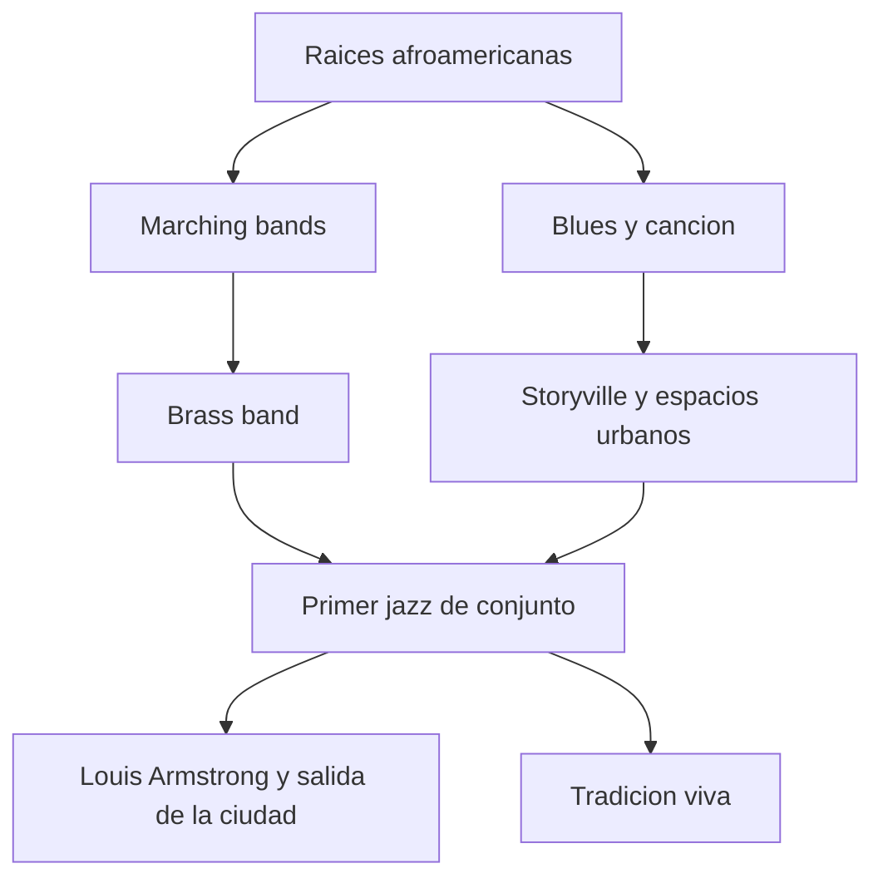
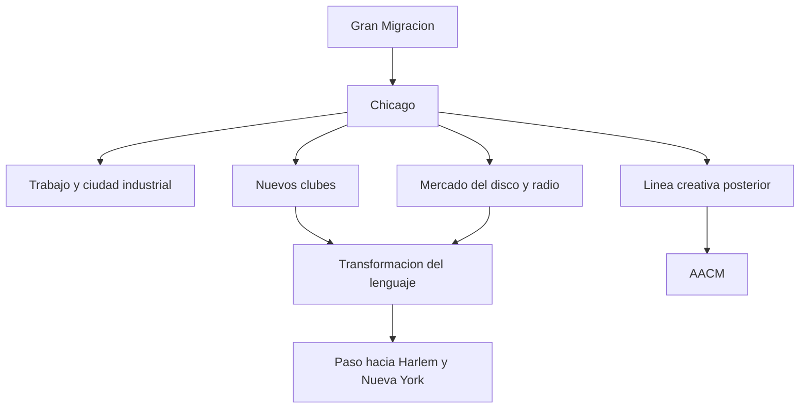
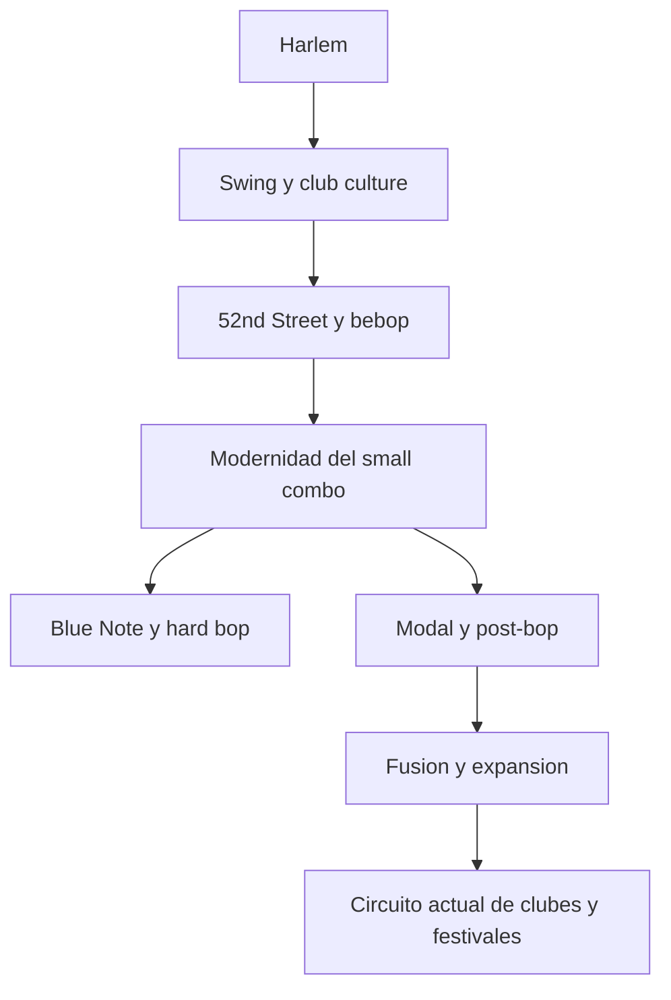

# Mapas de New Orleans, Chicago y Nueva York

Este documento amplifica la capa geografica del proyecto con tres mapas muy concretos. No intenta dibujar calles exactas. Intenta aclarar funciones culturales y transiciones historicas.

## 1. New Orleans

### Que ayuda a ver

- mezcla de tradiciones
- centralidad del conjunto
- continuidad entre origen y presente

## 2. Chicago

### Que ayuda a ver

- migracion
- profesionalizacion
- continuidad entre historia temprana y creatividad posterior

## 3. Nueva York

### Que ayuda a ver

- paso de la capital simbolica del swing a la modernidad bop
- consolidacion del small combo
- peso del presente institucional y de circuito

## 4. Cruces utiles

- [MAPAS-DE-CIUDADES-Y-ESCENAS.md](./MAPAS-DE-CIUDADES-Y-ESCENAS.md)
- [../HISTORIA-DEL-JAZZ/CRONOLOGIAS-POR-INSTRUMENTO-Y-ESCENA.md](../HISTORIA-DEL-JAZZ/CRONOLOGIAS-POR-INSTRUMENTO-Y-ESCENA.md)
- [../HISTORIA-DEL-JAZZ/CIUDADES-Y-ESCENAS-CLAVE.md](../HISTORIA-DEL-JAZZ/CIUDADES-Y-ESCENAS-CLAVE.md)

## Idea final

Pensar el jazz por ciudades no es decorar la historia con nombres de mapa. Es entender que el sonido necesita lugares, circuitos y desplazamientos.
