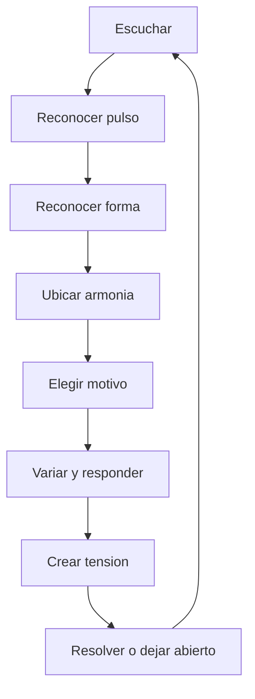

# Tecnica y teoria del jazz

## Proposito

Esta seccion explica conceptos tecnicos del jazz sin convertirlos en un muro de teoria. La idea es aprender vocabulario musical suficiente para escuchar mejor: reconocer formas, entender por que ciertas escalas funcionan, seguir una progresion armonica basica y distinguir recursos de improvisacion.

## Como usar esta carpeta

1. Empieza por ritmo y fraseo.
2. Sigue con formas y estructuras.
3. Pasa despues a armonia, escalas y modos.
4. Termina con improvisacion y lenguaje.

## Esquema visual rapido

## Documentos

- [RITMO-SWING-Y-FRASEO.md](./RITMO-SWING-Y-FRASEO.md)
- [ESTRUCTURAS-FORMAS-Y-STANDARDS.md](./ESTRUCTURAS-FORMAS-Y-STANDARDS.md)
- [ARMONIA-ESCALAS-Y-MODOS.md](./ARMONIA-ESCALAS-Y-MODOS.md)
- [IMPROVISACION-Y-LENGUAJE.md](./IMPROVISACION-Y-LENGUAJE.md)

## Apoyo visual

- [../RECURSOS-VISUALES/DIAGRAMAS-MERMAID.md](../RECURSOS-VISUALES/DIAGRAMAS-MERMAID.md) contiene diagramas sobre forma, improvisacion y small combo
- [../RECURSOS-VISUALES/FORMAS-STANDARDS-Y-PROGRESIONES.md](../RECURSOS-VISUALES/FORMAS-STANDARDS-Y-PROGRESIONES.md) desarrolla blues, AABA, rhythm changes, ii-V-I, sustituciones y construccion de solos
- [../RECURSOS-VISUALES/ESQUEMAS-EXPLICATIVOS.md](../RECURSOS-VISUALES/ESQUEMAS-EXPLICATIVOS.md) contiene plantillas para escuchar blues, AABA, bateria, piano y albumes

## Lo que deberias aprender aqui

- escuchar el swing como sensacion ritmica, no solo como etiqueta historica
- reconocer blues, rhythm changes, AABA y formas modales
- entender acordes septima, dominantes, ii-V-I, sustituciones y tensiones
- distinguir escalas mayores, menores, pentatonicas, blues, bebop y modos
- comprender como un solo se construye con motivos, desarrollo, tension y resolucion

## Nota importante

La teoria en jazz no deberia apagar la escucha. Debe hacer lo contrario: darte mas formas de oir.
